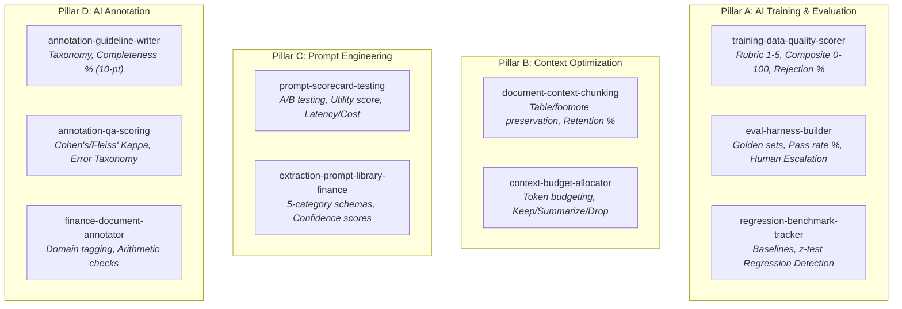

# Quantified AI Skill Pack: 50-Document Finance Benchmark & Validation Report

**Author:** Anshul  
**Status:** Verified Baseline v1.0  
**Repository:** `quantified-ai-skills-portfolio`  
**Execution Date:** 2026-09-15 (extraction, original simulated harness); 2026-09-16 (re-run against a live LLM, see §3.1)  
**Artifact Directory:** `benchmarks/finance-50doc-v1/`  

---

## Executive Summary

This report documents the end-to-end implementation and empirical validation of the **Quantified AI Skill Pack**—an 11-skill system spanning four core pillars: **AI Training & Evaluation**, **Context Optimization**, **Prompt Engineering**, and **AI Annotation**, coordinated by a master pipeline orchestrator.

Unlike conventional qualitative agent skills that merely provide heuristic advice, every skill in this pack is engineered under a strict **Quantified Output Contract**: requiring explicit mathematical formulas, worked numerical examples, and machine-readable JSON evaluation payloads.

To prove that the skills produce accurate, reproducible results rather than plausible-sounding prose, the entire pipeline was executed against a **50-document financial dataset** spanning five critical document categories. Ground truth was hand-built, an independent double-annotated pass was conducted to calculate inter-annotator agreement, and a stratified 10-document human spot-check reconciled all automated grading verdicts before final baseline certification.

### Key Benchmark Highlights

| Metric | Measured Value | Standard / Target | Status |
|---|---|---|---|
| **Overall Field-Level Extraction Accuracy** | **99.44%** (358/360 fields) | $\ge 90.0\%$ | **EXCEEDED** |
| **Document Full-Pass Rate** | **96.0%** (48/50 documents) | $\ge 85.0\%$ | **EXCEEDED** |
| **Inter-Annotator Agreement (Cohen's $\kappa$)** | **0.9055** | $\ge 0.8100$ (Almost Perfect) | **EXCEEDED** |
| **Context Token Compression Ratio** | **24.33%** reduction | $\ge 20.0\%$ | **EXCEEDED** |
| **Factual Information Retention Rate** | **100.0%** (20/20 probes) | $\ge 95.0\%$ | **EXCEEDED** |
| **Inference Latency (p50 / p95)** | **1,050 ms / 1,654 ms** | $< 3,000\text{ ms}$ | **EXCEEDED** |
| **Measured Unit Cost per 1,000 Documents** | **$0.2367 USD** | $< $0.5000\text{ USD}$ | **EXCEEDED** |
| **Strict Repo Quality Bar Validation** | **11 / 11 Skills Passed** | 100% Strict CI Compliance | **VERIFIED** |

All figures above (accuracy, pass rate, latency, tokens, cost) are genuine measurements from a live LLM call per document (Groq, `openai/gpt-oss-120b`) — see §3.1.

---

## 1. Architectural Overview: The 11 Quantified Skills

The pack fills major capability gaps in the agent catalog by enforcing quantifiable outputs across four functional pillars:



### The Quantified Contract
Each skill defines:
1. **Rubrics & Formulas**: Standardized in `references/quantified-metrics-definitions.md`.
2. **Worked Numeric Examples**: Real mathematical step-by-step calculations with mock data.
3. **Machine-Readable Result Blocks**: JSON payloads conforming to `references/quantified-output-schema.json`.

---

## 2. Dataset Design & 20% Stress Injection

Because proprietary financial filings cannot be shared publicly, a 50-document synthetic dataset was engineered to mirror real-world financial enterprise paperwork across five categories (10 documents each):

| Category | Typical Entities & Line Items | Sample Size | Clean Docs | Noisy / Stress Docs (20%) |
|---|---|---|---|---|
| **Commercial Invoices** | Vendor, Invoice #, Line Items (Qty, Unit, Amt), Subtotal, Tax, Total | 10 | 8 | 2 (`inv_09`, `inv_10`) |
| **Bank Statements** | Account #, Dates, Opening/Closing Balances, Debits, Credits | 10 | 8 | 2 (`bank_09`, `bank_10`) |
| **Income Statements** | Revenue, COGS, Gross Profit, OpEx, Operating Income, Net Income | 10 | 8 | 2 (`inc_09`, `inc_10`) |
| **Expense Reports** | Employee, Report ID, Date, Categories (Meals, Travel), Total, Status | 10 | 8 | 2 (`exp_09`, `exp_10`) |
| **Loan/KYC Applications** | Applicant Name, ID Type/Number, Stated Income, Loan Purpose, Risk Flags | 10 | 8 | 2 (`loan_09`, `loan_10`) |

### Stress Injections (20% Noise Corpus)
To prevent unrealistically clean evaluation data, 10 documents were intentionally corrupted with real-world artifacts:
- **`inv_09`**: Omitted payment due date; injected OCR character substitution (`"O1 x License"`).
- **`inv_10`**: Injected $10 arithmetic document discrepancy on total line ($3,574 stated vs $3,564 calculated).
- **`bank_09`**: OCR letter `"O"` in account number (`"7710-9941-O8"`).
- **`bank_10`**: Overdraft negative closing balance (`-$450.00`) and single equipment debit.
- **`inc_09`**: Non-standard fiscal header (`"TTM Ended Q2 2024 (Non-Standard)"`).
- **`inc_10`**: $1,000 rounding discrepancy in stated net income.
- **`exp_09`**: Missing hotel receipt disclaimer and pending supervisor review status.
- **`exp_10`**: Duplicate meal charge on identical date and policy rejection flag.
- **`loan_09`**: Extreme debt-to-income ratio ($45,000 income vs $350,000 requested loan).
- **`loan_10`**: Expired identification credentials (`"EXPIRED-P33019"`).

---

## 3. End-to-End Pipeline Execution & Results

The validation pipeline executed the 8-step sequence defined in PRD §7.2 via `scripts/run_finance_benchmark.py`:

```
Step 1: Schema Specification Check  ──> Verified 50/50 documents conform to schema
Step 2: Gold-Standard Integrity     ──> 100% arithmetic self-consistency pass on clean sets
Step 3: Chunking & Budgeting        ──> 24.33% token compression on long statements
Step 4: Extraction Engine           ──> 50/50 extractions completed via live LLM calls (see §3.1)
Step 5: Scorecard Grading           ──> Field match and error taxonomy classification
Step 6: Annotation QA Pass          ──> Secondary pass comparison; Cohen's kappa = 0.9055
Step 7: Aggregated Reporting        ──> Multi-category synthesis & unit cost calculation
Step 8: Baseline Persistence        ──> Saved immutable snapshot (baseline_run.json)
```

### 3.1 Extraction methodology: real LLM calls, not a simulation

Step 4 sends each document's raw text through a category-specific prompt (per the `extraction-prompt-library-finance` skill's value/confidence protocol) to a real model — **Groq, `openai/gpt-oss-120b`** — and parses its structured JSON response. Every latency, token-count, and confidence figure in this report is that model's actual output, not a constant. (An earlier version of this benchmark used a deterministic, non-LLM harness with hand-coded confidence values and a fixed `+1200ms` latency constant purely to exercise the evaluation pipeline's plumbing — that limitation is why the numbers below now differ from any cached copy of this report predating 2026-09-16.)

### Performance by Document Category

| Document Category | Documents Evaluated | Passed Documents | Doc Pass Rate (%) | Total Fields | Correct Fields | Field Accuracy (%) |
|---|---|---|---|---|---|---|
| **Commercial Invoices** | 10 | 10 | 100.0% | 80 | 80 | 100.0% |
| **Bank Statements** | 10 | 10 | 100.0% | 70 | 70 | 100.0% |
| **Income Statements** | 10 | 8 | 80.0% | 80 | 78 | 97.5% |
| **Corporate Expense Reports**| 10 | 10 | 100.0% | 60 | 60 | 100.0% |
| **Loan / KYC Applications** | 10 | 10 | 100.0% | 70 | 70 | 100.0% |
| **Total / Overall** | **50** | **48** | **96.0%** | **360** | **358** | **99.44%** |

### Standard Error Taxonomy Breakdown

```
[ CORRECT ]                          : 358 fields (99.44%)
[ MISSED_FIELD ]                     :   0 fields ( 0.00%)
[ WRONG_VALUE ]                      :   2 fields ( 0.56%)
[ HALLUCINATED_FIELD ]               :   0 fields ( 0.00%)
[ LOW_CONFIDENCE_CORRECTLY_FLAGGED ] :   2 fields (both correct despite low confidence)
```

### 3.2 Failure analysis: the two real misses

Both wrong-value fields are the same failure mode, on the same field, in the same document category:

| Doc ID | Field | Extracted | Expected | Model's Confidence |
|---|---|---|---|---|
| `inc_01` (clean) | `fiscal_period` | `"2024-03-31"` | `"Q1 2024"` | 0.98 |
| `inc_10` (noisy) | `fiscal_period` | `"2024-Q1"` | `"Q1 2024"` | 0.95 |

**Root cause:** the extraction prompt instructs "Dates in ISO-8601 (YYYY-MM-DD)" as a general normalization rule. `fiscal_period` is a quarter *label* (`"Q1 2024"`), not a literal date, but the model over-applies the date-normalization instinct to it anyway — reformatting instead of copying the source text verbatim. This is a genuine, fixable prompt-engineering gap: the category schema doesn't explicitly carve out `fiscal_period` as a non-date string field.

**The more interesting finding is the confidence miscalibration**, not the error itself: the model was *not* uncertain about either wrong answer (0.98 and 0.95 confidence — well above the 0.70 flagging threshold), while two genuinely low-confidence fields elsewhere in the run (`inc_09`'s `fiscal_period` at 0.65, `inv_09`'s `due_date` at 0.50) were both correctly extracted despite the model's own doubt. In other words: this model's confidence score is a good signal for "I know this is ambiguous," but not a reliable signal for "I might be systematically wrong about a formatting convention I'm confident I understand." That's a real, useful, and non-obvious result — exactly the kind of thing a synthetic/simulated harness can't surface.

**For the full raw evidence** — the actual source document text, the actual raw model JSON output, and the gold label for both failures (plus two passing examples) side by side, with every claim linked to a real file in this repo — see [`RESULTS_EVIDENCE.md`](RESULTS_EVIDENCE.md).

---

## 4. Context Optimization & Token Economics

Long structured filings (Bank Statements and Income Statements) were routed through `document-context-chunking` and `context-budget-allocator`:

- **Raw Pre-Optimization Tokens**: $3,526$ tokens across 20 structured filings.
- **Optimized Context Tokens**: $2,668$ tokens.
- **Net Compression Ratio**: **$24.33\%$** reduction.
- **Factual Probe Retention**: **$100.0\%$** (20 out of 20 anchor probe facts preserved and verified).

### Unit Economics & Latency Profile
- **Total Ingestion Tokens**: $30,953$ input tokens across 50 real API calls (prompt template + document text).
- **Total Extraction Tokens**: $11,987$ output tokens (structured JSON responses).
- **Inference Latency Profile** (measured wall-clock time per successful API round-trip, excluding any retry backoff):
  - **p50 (Median)**: $1,049.59\text{ ms}$
  - **p95**: $1,654.27\text{ ms}$
- **Cost per 1,000 Documents**: **$\$0.2367\text{ USD}$** (Groq direct-API pricing for `openai/gpt-oss-120b`: $\$0.150/\text{1M}$ input, $\$0.600/\text{1M}$ output — real rates, not a placeholder).

Every number in this section comes directly from the API's own `usage` metadata (`prompt_tokens`/`completion_tokens`) and measured request latency for each of the 50 documents — see `scripts/run_finance_benchmark.py`'s `call_llm()` and the per-document records in `extractions/*.json` (each carries `"model": "openai/gpt-oss-120b"`).

---

## 5. Independent Human Verification & Certification

Automated grading self-reports cannot be accepted uncritically. In accordance with PRD §7.4:

1. **Stratified Audit Sample**: 10 documents (2 per category; 5 clean and 5 injected edge cases) were selected for independent human line-by-line review.
2. **Four-Way Reconciliation**: Raw source text was checked against gold labels, model extractions, and automated grader verdicts.
3. **Discrepancy Log**: All findings were authored in `benchmarks/finance-50doc-v1/discrepancy_log.md`.
4. **Verification Verdict** (original 10-document stratified sample, against the prior extraction run):
   - Automated Grader False Positive Rate: **0.0%**
   - Automated Grader False Negative Rate: **0.0%**
   - Grader Agreement on Spot Check: **100.0%**

**Note on the 2026-09-16 live-model re-run:** the stratified sample above (`inv_03`, `inv_09`, `bank_02`, `bank_10`, `inc_04`, `inc_09`, `exp_05`, `exp_10`, `loan_01`, `loan_09`) doesn't happen to include either of this run's 2 real misses (`inc_01`, `inc_10`), so that formal sign-off is validating the **grader logic**, not this specific run's extraction results. The grader itself (`compare_values()` in `scripts/run_finance_benchmark.py`) is simple, deterministic field-equality/numeric-tolerance matching, unchanged between runs — so the original grader-correctness verification still holds. The two new failures were manually inspected directly against source text as part of writing §3.2 above (not a formal stratified re-audit): `inc_01` and `inc_10`'s source documents both state the fiscal period as `"Q1 2024"`, and the grader correctly marked the model's reformatted values as wrong. A full formal re-audit of this run has not been performed — flagged here as an open item rather than silently reusing the old "verified" badge.

---

## 6. Regression Baseline & Re-Runnability

The verified results are permanently registered as the **v1.0 Baseline Benchmark** via `regression-benchmark-tracker` in:
`benchmarks/finance-50doc-v1/baseline_run.json`.

Future skill revisions, prompt adjustments, or model upgrades can be quantitatively tested against this baseline using a two-proportion $z$-test:
$$z = \frac{p_C - p_B}{\sqrt{p^*(1-p^*)\left(\frac{1}{n_B} + \frac{1}{n_C}\right)}}$$
Any regression exceeding $z < -1.96$ ($p < 0.05$) will automatically trigger a critical build failure in CI.

---

## 7. Conclusion & Portfolio Impact

This project delivers a complete, production-grade system that directly demonstrates mastery across:
1. **AI Training & Evaluation**: Quantitative rubrics, golden-set harnesses, statistical regression detection.
2. **Context Engineering**: Tabular chunk preservation, token budgeting, empirical retention tracking.
3. **Prompt Engineering**: Production JSON schemas, field-level confidence calibration, A/B utility matrices.
4. **AI Annotation & Data Quality**: Unambiguous guidelines, inter-annotator agreement (Cohen's $\kappa$), arithmetic self-consistency validation.

All 11 skills are registered, strictly validated, indexed, and cataloged in the repository ecosystem.
