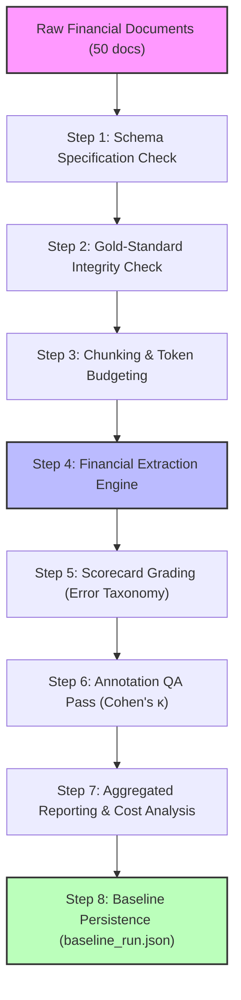

# 📊 Visual Guide: Quantified AI Skills Architecture

> **A comprehensive visual reference illustrating the system architecture, mathematical foundations, 50-document financial benchmark pipeline, and repository structure.**

---

## 1. System Architecture: The 4 Pillars

```
┌────────────────────────────────────────────────────────────────────────────────────────┐
│                          QUANTIFIED AI SKILLS ARCHITECTURE                             │
└──────────────────────────────────────────┬─────────────────────────────────────────────┘
                                           │
         ┌─────────────────────────────────┼─────────────────────────────────┐
         │                                 │                                 │
         ▼                                 ▼                                 ▼
┌───────────────────┐             ┌───────────────────┐             ┌───────────────────┐
│     PILLAR A      │             │     PILLAR B      │             │     PILLAR C      │
│ AI Training/Eval  │             │ Context Window    │             │ Prompt Eng.       │
├───────────────────┤             ├───────────────────┤             ├───────────────────┤
│ • training-data-  │             │ • document-       │             │ • prompt-         │
│   quality-scorer  │             │   context-        │             │   scorecard-      │
│ • eval-harness-   │             │   chunking        │             │   testing         │
│   builder         │             │ • context-        │             │ • extraction-     │
│ • regression-     │             │   budget-         │             │   prompt-library- │
│   benchmark-      │             │   allocator       │             │   finance         │
│   tracker         │             │                   │             │                   │
└─────────┬─────────┘             └─────────┬─────────┘             └─────────┬─────────┘
          │                                 │                                 │
          └────────────────────────┐        │        ┌────────────────────────┘
                                   │        │        │
                                   ▼        ▼        ▼
                        ┌───────────────────────────────────────┐
                        │               PILLAR D                │
                        │             AI Annotation             │
                        ├───────────────────────────────────────┤
                        │ • annotation-guideline-writer         │
                        │ • annotation-qa-scoring               │
                        │ • finance-document-annotator          │
                        └───────────────────┬───────────────────┘
                                            │
                                            ▼
                        ┌───────────────────────────────────────┐
                        │          MASTER ORCHESTRATOR          │
                        │     quantified-eval-orchestrator      │
                        │ (End-to-End Pipeline & Scorecards)    │
                        └───────────────────────────────────────┘
```

---

## 2. End-to-End Benchmark Pipeline Flow



---

## 3. 50-Document Dataset Composition & Stress Injection

```
┌────────────────────────────────────────────────────────────────────────────────────────┐
│                        50-DOCUMENT FINANCIAL BENCHMARK CORPUS                          │
├───────────────────────────────┬────────────┬─────────────┬─────────────────────────────┤
│ Document Category             │ Total Docs │ Clean (80%) │ Noisy / Stress Injected(20%)│
├───────────────────────────────┼────────────┼─────────────┼─────────────────────────────┤
│ 1. Commercial Invoices        │ 10 docs    │ 8 docs      │ 2 docs (inv_09, inv_10)     │
│ 2. Bank Statements            │ 10 docs    │ 8 docs      │ 2 docs (bank_09, bank_10)   │
│ 3. Income Statements          │ 10 docs    │ 8 docs      │ 2 docs (inc_09, inc_10)     │
│ 4. Expense Reports            │ 10 docs    │ 8 docs      │ 2 docs (exp_09, exp_10)     │
│ 5. Loan / KYC Applications    │ 10 docs    │ 8 docs      │ 2 docs (loan_09, loan_10)   │
├───────────────────────────────┼────────────┼─────────────┼─────────────────────────────┤
│ TOTAL CORPUS                  │ 50 docs    │ 40 docs     │ 10 docs (20% Noise Corpus)  │
└───────────────────────────────┴────────────┴─────────────┴─────────────────────────────┘
```

### Stress Artifacts Handled
- **`inv_09`**: OCR character substitution (`"O1 x License"`) and omitted due date.
- **`inv_10`**: Injected $10 arithmetic document discrepancy on total line.
- **`bank_09`**: OCR letter `"O"` in numerical account number.
- **`bank_10`**: Overdraft negative closing balance (`-$450.00`).
- **`inc_09`**: Non-standard fiscal header (`"TTM Ended Q2 2024"`).
- **`inc_10`**: $1,000 rounding discrepancy in stated net income.
- **`exp_09`**: Missing hotel receipt disclaimer and pending review status.
- **`exp_10`**: Duplicate meal charge on identical date.
- **`loan_09`**: Extreme debt-to-income ratio ($45,000 income vs $350,000 requested).
- **`loan_10`**: Expired identification credentials (`"EXPIRED-P33019"`).

---

## 4. The Quantified Output Contract

```
                     ┌────────────────────────────────────┐
                     │          SKILL INVOCATION          │
                     └─────────────────┬──────────────────┘
                                       │
                                       ▼
        ┌─────────────────────────────────────────────────────────────┐
        │ 1. MATHEMATICAL FORMULAS & RUBRICS                          │
        │    • Accuracy % = (Correct Fields / Total Fields) * 100     │
        │    • Cohen's κ = (Po - Pe) / (1 - Pe)                       │
        │    • Two-Proportion z-test for regression detection         │
        └──────────────────────────────┬──────────────────────────────┘
                                       │
                                       ▼
        ┌─────────────────────────────────────────────────────────────┐
        │ 2. WORKED NUMERICAL EXAMPLES                                │
        │    • Step-by-step mathematical proofs with real numbers     │
        └──────────────────────────────┬──────────────────────────────┘
                                       │
                                       ▼
        ┌─────────────────────────────────────────────────────────────┐
        │ 3. MACHINE-READABLE JSON PAYLOAD                            │
        │    • Conforms to references/quantified-output-schema.json   │
        │    • Standardized 5-state Error Taxonomy                    │
        └─────────────────────────────────────────────────────────────┘
```

---

## 5. Repository File Structure

```
ai-skills/
├── 📄 README.md                           ← Portfolio overview & verified highlights
├── 📄 HOW_TO_USE.md                       ← Plain-English guide for business & non-tech
├── 📄 SKILLS_GUIDE.md                     ← Comprehensive technical manual for 11 skills
├── 📄 ROOT_CAUSE_ANALYSIS.md              ← Engineering RCA of defects fixed
├── 📄 tasks.md                            ← Execution roadmap & task log
├── 📄 prd.md                              ← Product requirements & mathematical standards
│
├── 📁 skills/                             ← All 11 Quantified Skills live here
│   ├── 📁 training-data-quality-scorer/   ← Pillar A: Data quality scoring
│   ├── 📁 eval-harness-builder/           ← Pillar A: Golden-set grading harness
│   ├── 📁 regression-benchmark-tracker/   ← Pillar A: Statistical z-test tracking
│   ├── 📁 document-context-chunking/      ← Pillar B: Semantic table chunking
│   ├── 📁 context-budget-allocator/       ← Pillar B: Token compression budgeting
│   ├── 📁 prompt-scorecard-testing/       ← Pillar C: Prompt A/B utility testing
│   ├── 📁 extraction-prompt-library-finance/ ← Pillar C: 5-category extraction
│   ├── 📁 annotation-guideline-writer/    ← Pillar D: Guideline authoring
│   ├── 📁 annotation-qa-scoring/          ← Pillar D: Cohen's Kappa QA
│   ├── 📁 finance-document-annotator/     ← Pillar D: Domain document annotator
│   └── 📁 quantified-eval-orchestrator/   ← Master pipeline orchestrator
│
├── 📁 benchmarks/finance-50doc-v1/        ← 50-Document Financial Benchmark Suite
│   ├── 📄 REPORT.md                       ← Verified baseline scorecard report
│   ├── 📄 discrepancy_log.md              ← 10-document human audit log
│   ├── 📄 baseline_run.json               ← Immutable regression baseline
│   ├── 📁 documents/                      ← 50 synthetic financial documents
│   ├── 📁 gold_labels/                    ← 50 ground-truth answer keys
│   ├── 📁 extractions/                    ← 50 model extraction outputs
│   └── 📁 per_doc_eval/                   ← 50 automated evaluation scorecards
│
├── 📁 references/                         ← Shared specifications & schemas
│   ├── 📄 quantified-metrics-definitions.md ← Mathematical formulas reference
│   └── 📄 quantified-output-schema.json    ← Machine-readable JSON contract
│
├── 📁 scripts/                            ← Test and automation harnesses
│   ├── 📄 run_finance_benchmark.py        ← Benchmark runner
│   ├── 📄 validate_skills.py              ← Strict skill schema validator
│   ├── 📄 validate_references.py          ← Cross-reference validator
│   └── 📁 tests/                          ← Repo integrity test suites
│
└── 📁 docs/                               ← Complete documentation suite
    ├── 📄 GETTING_STARTED.md              ← Quickstart in under 5 minutes
    ├── 📄 USAGE.md                        ← Practical usage guide
    ├── 📄 FAQ.md                          ← Frequently asked questions
    ├── 📄 BUNDLES.md                      ← Curated skill collections
    ├── 📄 WORKFLOWS.md                    ← Multi-skill execution playbooks
    ├── 📄 EXAMPLES.md                     ← Real-world cookbook recipes
    ├── 📄 VISUAL_GUIDE.md                 ← This architectural visual guide
    ├── 📄 QUALITY_BAR.md                  ← Quality standards & validation
    ├── 📄 SKILL_ANATOMY.md                ← Anatomical structure of a skill
    ├── 📄 SECURITY_GUARDRAILS.md          ← Data privacy & safety policy
    ├── 📄 SOURCES.md                      ← Academic & domain attributions
    ├── 📄 AUDIT.md                        ← Coherence & integrity audit
    └── 📄 CI_DRIFT_FIX.md                 ← Registry sync guide
```
