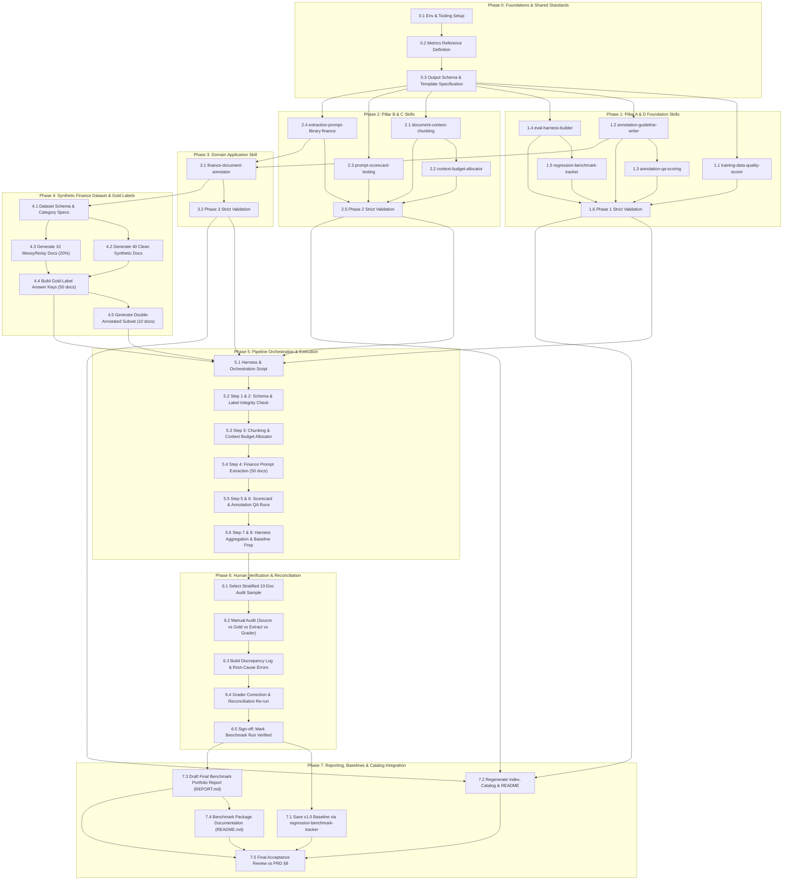

# Tasks: Quantified Skill Pack & 50-Document Finance Validation Run

Based on [PRD: AI Training/Evaluation, Context Optimization, Prompt Engineering & Annotation Skill Pack](prd.md).

---

## Dependency Overview & Execution Roadmap



---

## Phase 0: Project Setup & Shared Foundations

*Goal: Establish project prerequisites, standardize mathematical formulas for metrics, and define common machine-readable schemas to guarantee consistency across all 10 skills.*

### [x] Task 0.1: Environment & Tooling Verification
- **Description:** Verify availability of runtime tools (`node`, `npm`, `python3`, `pip`) and validate repo dependencies (`npm ci`, `pip install -r requirements.txt`).
- **Dependencies:** None.
- **Inputs:** Local workspace, repository `package.json`, `requirements.txt`.
- **Outputs:** Verified operational environment with validator tools accessible.
- **Definition of Done:**
  - `npm run validate:strict` (or underlying `python scripts/validate_skills.py`) runs successfully without syntax/environment failures.
  - Python virtual environment is configured with required testing/data libraries.

### [x] Task 0.2: Shared Quantified Metrics Definition Document
- **Description:** Author a single canonical mathematical reference document (`references/quantified-metrics-definitions.md`) defining unambiguous formulas, input variables, edge-case math (e.g. division by zero, empty fields), and units of measurement.
- **Dependencies:** Task 0.1.
- **Inputs:** PRD §4, §5, §7.3, §10.
- **Outputs:** `references/quantified-metrics-definitions.md`.
- **Definition of Done:**
  - Standardized formulas documented for:
    - Field-Level Extraction Accuracy (`Correct Fields / Total Expected Fields`)
    - Document-Level Full-Pass Rate (`Strict match of 100% required fields`)
    - Inter-Annotator Agreement (Cohen’s $\kappa$ and Fleiss’ $\kappa$)
    - Token Compression Ratio & Information Retention %
    - Quality Composite Score (1–5 rubric weighted composite to 0–100)
    - Statistical Significance z-test for pass rate changes ($\Delta$ accuracy vs baseline)
    - Cost per 1,000 documents formula (`(Input Tokens * Rate_in + Output Tokens * Rate_out) * 1000 / N`)
  - Error taxonomy standardized (`missed_field`, `wrong_value`, `hallucinated_field`, `low_confidence_correctly_flagged`).

### [x] Task 0.3: Machine-Readable Quantified Output JSON Schema Template
- **Description:** Define standard JSON schemas and markdown codeblock conventions for the `## Quantified Output` machine-readable blocks emitted by skills.
- **Dependencies:** Task 0.2.
- **Inputs:** PRD §4.
- **Outputs:** `references/quantified-output-schema.json`.
- **Definition of Done:**
  - JSON Schema specifies required top-level properties: `skill_name`, `version`, `timestamp`, `metrics` (object of numeric key-values), `sample_size`, and `status` (`pass`/`fail`/`warn`).
  - Clear snippet guidelines for embedding ```json blocks in agent responses.

---

## Phase 1: Pillar A & Pillar D Foundation Skills (Training, Eval & Annotation Core)

*Goal: Build the 5 fundamental evaluation and annotation skills adhering strictly to the repo quality bar and the Quantified Output standard.*

### [x] Task 1.1: Implement `training-data-quality-scorer` Skill
- **Path:** `skills/training-data-quality-scorer/SKILL.md`
- **Description:** Skill that evaluates candidate training or fine-tuning examples across 4 dimensions (Relevance, Correctness, Diversity, Label Consistency) using a 1–5 rubric, calculates a 0–100 composite score, and flags batch rejection rates.
- **Dependencies:** Task 0.2, Task 0.3.
- **Inputs:** PRD §5 (Pillar A).
- **Outputs:** `skills/training-data-quality-scorer/SKILL.md`.
- **Definition of Done:**
  - Valid frontmatter: `name: training-data-quality-scorer`, `description` (<200 chars, states trigger conditions), `risk: safe`, `source: self`.
  - Sections present: `## When to Use`, `## Evaluation Rubric (1–5)`, `## Scoring Formula`, `## Examples`, `## Limitations`, `## Quantified Output`.
  - Worked numeric example calculating composite score and batch rejection threshold.
  - Machine-readable JSON result block specification.

### [x] Task 1.2: Implement `annotation-guideline-writer` Skill
- **Path:** `skills/annotation-guideline-writer/SKILL.md`
- **Description:** Skill to author rigorous, unambiguous labeling schemas, label taxonomies, edge-case resolution rules, and 3–5 worked positive/negative examples for any annotation project.
- **Dependencies:** Task 0.2, Task 0.3.
- **Inputs:** PRD §5 (Pillar D).
- **Outputs:** `skills/annotation-guideline-writer/SKILL.md`.
- **Definition of Done:**
  - Valid frontmatter meeting repo strict criteria.
  - Sections present: `## When to Use`, `## Guideline Structure Checklist`, `## Edge-Case Handling Rules`, `## Examples`, `## Limitations`, `## Quantified Output`.
  - Quantified metric: Guideline Completeness Score (checklist % out of 100) and explicit covered edge-case count.
  - Worked numeric example and JSON output block.

### [x] Task 1.3: Implement `annotation-qa-scoring` Skill
- **Path:** `skills/annotation-qa-scoring/SKILL.md`
- **Description:** Skill to compute inter-annotator agreement metrics (Cohen’s $\kappa$, Fleiss’ $\kappa$), evaluate annotations against gold-standard sets, and produce an error-taxonomy breakdown.
- **Dependencies:** Task 1.2.
- **Inputs:** PRD §5 (Pillar D).
- **Outputs:** `skills/annotation-qa-scoring/SKILL.md`.
- **Definition of Done:**
  - Valid frontmatter and standard sections.
  - Mathematical steps and formulas for Cohen’s Kappa ($P_o - P_e / (1 - P_e)$) and gold-set accuracy %.
  - Worked numeric example with a sample 2x2 or 3x3 agreement matrix.
  - Machine-readable JSON output specification including error taxonomy counts.

### [x] Task 1.4: Implement `eval-harness-builder` Skill
- **Path:** `skills/eval-harness-builder/SKILL.md`
- **Description:** Skill to assemble reusable evaluation sets (input $\rightarrow$ ground truth $\rightarrow$ deterministic/LLM grader), define pass/fail thresholds, and establish human-review escalation rules when grader confidence is low.
- **Dependencies:** Task 0.2, Task 0.3.
- **Inputs:** PRD §5 (Pillar A).
- **Outputs:** `skills/eval-harness-builder/SKILL.md`.
- **Definition of Done:**
  - Valid frontmatter and required trigger/limitation sections.
  - Step-by-step harness specification: dataset packaging, execution loop, grading criteria, and escalation triggers.
  - Quantified metrics: Pass rate %, Grader-agreement % vs human spot-check sample.
  - Worked numeric example and JSON output block.

### [x] Task 1.5: Implement `regression-benchmark-tracker` Skill
- **Path:** `skills/regression-benchmark-tracker/SKILL.md`
- **Description:** Skill to store benchmark run outputs, compare candidate model/prompt runs against previous baselines, compute metric deltas ($\Delta$ accuracy, latency, cost), and run statistical tests (z-test on proportions) to detect regressions.
- **Dependencies:** Task 1.4.
- **Inputs:** PRD §5 (Pillar A).
- **Outputs:** `skills/regression-benchmark-tracker/SKILL.md`.
- **Definition of Done:**
  - Valid frontmatter and standard anatomy sections.
  - Storage format specification for historical benchmark records (`benchmarks/<name>/baseline_run.json`).
  - Mathematical definition for two-proportion z-test to flag statistically significant regressions ($p < 0.05$).
  - Worked numeric example with delta calculation and JSON output block.

### [x] Task 1.6: Strict Validation of Phase 1 Skills
- **Description:** Run automated validation tools against all 5 Phase 1 skills to ensure zero lint or schema errors.
- **Dependencies:** Tasks 1.1, 1.2, 1.3, 1.4, 1.5.
- **Inputs:** Phase 1 `SKILL.md` files.
- **Outputs:** Clean validator execution logs.
- **Definition of Done:**
  - Validator script confirms all 5 skills pass metadata, trigger headings, risk classification, examples, limitations, and char limits.

---

## Phase 2: Pillar B & Pillar C Skills (Context Optimization & Prompt Engineering)

*Goal: Build the 4 context optimization and prompt engineering skills, ensuring each enforces numeric retention, token budgets, and comparative scorecards.*

### [x] Task 2.1: Implement `document-context-chunking` Skill
- **Path:** `skills/document-context-chunking/SKILL.md`
- **Description:** Skill to partition long, semi-structured documents (financial reports, filings, contracts) preserving tables, hierarchical section headers, and footnote cross-references while measuring retention.
- **Dependencies:** Task 0.2, Task 0.3.
- **Inputs:** PRD §5 (Pillar B).
- **Outputs:** `skills/document-context-chunking/SKILL.md`.
- **Definition of Done:**
  - Frontmatter and standard sections fully compliant.
  - Instructions for chunk boundary heuristics (keeping tabular data intact, tagging chunks with parent section metadata).
  - Quantified metrics: Token count before vs after, Retrieval Recall / Information Retention % over known probe facts.
  - Worked numeric example with dummy table/prose chunking and JSON output block.

### [x] Task 2.2: Implement `context-budget-allocator` Skill
- **Path:** `skills/context-budget-allocator/SKILL.md`
- **Description:** Skill to allocate a rigid token budget across multi-document sources, systematically prioritizing what to retain raw, what to compress/summarize, and what to drop, while estimating impact on task accuracy.
- **Dependencies:** Task 2.1.
- **Inputs:** PRD §5 (Pillar B).
- **Outputs:** `skills/context-budget-allocator/SKILL.md`.
- **Definition of Done:**
  - Frontmatter and standard anatomy sections.
  - Explicit budget distribution algorithm (e.g. core entity 40%, supporting context 40%, reserve 20%).
  - Quantified metrics: Tokens allocated vs consumed, Trim % delta, Measured downstream extraction accuracy before vs after trimming.
  - Worked numeric example and JSON output block.

### [x] Task 2.3: Implement `prompt-scorecard-testing` Skill
- **Path:** `skills/prompt-scorecard-testing/SKILL.md`
- **Description:** Skill to conduct systematic A/B or multi-variant prompt evaluations across labeled test sets, comparing variants along accuracy, token efficiency, latency (p50/p95), and estimated cost.
- **Dependencies:** Task 0.2, Task 0.3.
- **Inputs:** PRD §5 (Pillar C).
- **Outputs:** `skills/prompt-scorecard-testing/SKILL.md`.
- **Definition of Done:**
  - Frontmatter and standard sections.
  - Multi-variant comparison matrix format (Variant A vs B vs C across F1, Cost, Latency).
  - Quantified metrics: Accuracy/F1 %, p50/p95 latency (ms), Cost per 1k invocations ($).
  - Worked numeric example declaring winning prompt variant based on composite utility score.

### [x] Task 2.4: Implement `extraction-prompt-library-finance` Skill
- **Path:** `skills/extraction-prompt-library-finance/SKILL.md`
- **Description:** Domain-specific prompt templates and JSON schemas for extracting structured fields from 5 financial document types (Invoices, Bank Statements, Income Statements, Expense Reports, Loan/KYC Apps) requiring field-level confidence scores.
- **Dependencies:** Task 0.2, Task 0.3.
- **Inputs:** PRD §5 (Pillar C), §7.1.
- **Outputs:** `skills/extraction-prompt-library-finance/SKILL.md`.
- **Definition of Done:**
  - Frontmatter and standard sections.
  - Complete prompt templates and response JSON schemas for all 5 document categories.
  - Strict requirement that each extracted field includes `value` and `confidence` (0.0 to 1.0).
  - Quantified metrics: Field extraction accuracy %, Low-confidence detection accuracy % (precision of flags).
  - Worked numeric example and JSON block.

### [x] Task 2.5: Strict Validation of Phase 2 Skills
- **Description:** Run repo validator against all 4 Phase 2 skills.
- **Dependencies:** Tasks 2.1, 2.2, 2.3, 2.4.
- **Inputs:** Phase 2 `SKILL.md` files.
- **Outputs:** Clean validator execution logs.
- **Definition of Done:**
  - All 4 skills pass strict validation checks without warnings or errors.

---

## Phase 3: Domain Application Skill (Finance Document Annotation)

*Goal: Build the concrete domain annotation skill connecting guideline authoring to financial entity/line-item tagging.*

### [x] Task 3.1: Implement `finance-document-annotator` Skill
- **Path:** `skills/finance-document-annotator/SKILL.md`
- **Description:** Skill defining the exact operational procedures, entity tags, table line-item schemas, and risk/anomaly flag rules for financial documents to produce gold-standard datasets.
- **Dependencies:** Task 1.2, Task 2.4.
- **Inputs:** PRD §5 (Pillar D), §7.1.
- **Outputs:** `skills/finance-document-annotator/SKILL.md`.
- **Definition of Done:**
  - Frontmatter and standard sections.
  - Comprehensive field definitions across the 5 target categories:
    - Invoices (vendor, invoice_number, invoice_date, due_date, line_items[qty, desc, unit_price, amount], subtotal, tax, total)
    - Bank statements (bank_name, account_number, statement_period[start, end], opening_balance, closing_balance, transactions[date, desc, amount, balance])
    - Income statements (company_name, period, revenue, cost_of_goods_sold, gross_profit, operating_expenses, operating_income, net_income)
    - Expense reports (employee_name, report_id, submission_date, line_items[date, category, merchant, amount], total_amount, approval_status)
    - Loan/KYC applications (applicant_name, applicant_id_type, applicant_id_number, annual_income, requested_amount, loan_purpose, risk_flags)
  - Rules for anomaly/risk flag tagging (e.g., negative balances, math mismatches, missing vendor tax ID).
  - Quantified metrics: Labeled field count per doc, Self-consistency mathematical check pass rate %.
  - Worked numeric example and JSON output block.

### [x] Task 3.2: Strict Validation of Phase 3 Skill
- **Description:** Run repo validator against `finance-document-annotator`.
- **Dependencies:** Task 3.1.
- **Inputs:** `skills/finance-document-annotator/SKILL.md`.
- **Outputs:** Clean validator output.
- **Definition of Done:**
  - Skill passes `npm run validate:strict` (all 10 skills in the pack now validated).

---

## Phase 4: Synthetic Finance Dataset & Gold-Standard Ground Truth

*Goal: Generate a realistic 50-document finance dataset across 5 categories, with a 20% injection of messy edge cases, complete with definitive gold-label answer keys and a double-annotated subset.*

### [x] Task 4.1: Dataset Schema & Category Field Specifications
- **Description:** Write a data dictionary specification document for the synthetic benchmark dataset (`benchmarks/finance-50doc-v1/schema_spec.json`) specifying data types, required fields, optional fields, and regex validation patterns for all 5 categories.
- **Dependencies:** Task 3.1.
- **Inputs:** PRD §7.1.
- **Outputs:** `benchmarks/finance-50doc-v1/schema_spec.json`.
- **Definition of Done:**
  - Strict field specifications created for Invoices, Bank Statements, Income Statements, Expense Reports, and Loan/KYC applications.

### [x] Task 4.2: Generate 40 Clean Synthetic Financial Documents
- **Description:** Generate 40 realistic text/markdown financial documents (8 per category: Invoices `inv_01`–`inv_08`, Bank Statements `bank_01`–`bank_08`, Income Statements `inc_01`–`inc_08`, Expense Reports `exp_01`–`exp_08`, Loan/KYC `loan_01`–`loan_08`).
- **Dependencies:** Task 4.1.
- **Inputs:** Domain layouts and realistic values (realistic corporate names, addresses, line items, monetary figures).
- **Outputs:** Files in `benchmarks/finance-50doc-v1/documents/*.txt` (or `.md`).
- **Definition of Done:**
  - 40 files created with plausible formatting, internally consistent arithmetic (e.g. line items sum to total).

### [x] Task 4.3: Generate 10 Messy/Noisy Financial Documents (20% Stress Set)
- **Description:** Generate 10 deliberately messy financial documents (2 per category: `inv_09`–`inv_10`, `bank_09`–`bank_10`, `inc_09`–`inc_10`, `exp_09`–`exp_10`, `loan_09`–`loan_10`) injecting realistic flaws per PRD §10.
- **Dependencies:** Task 4.1.
- **Inputs:** PRD §10 (Risks & Mitigations).
- **Outputs:** Files in `benchmarks/finance-50doc-v1/documents/`.
- **Definition of Done:**
  - Flaws explicitly injected and logged:
    - Missing required fields (e.g. missing invoice due date, unlisted transaction description)
    - Ambiguous line item descriptions or OCR-like character corruptions (e.g. `S100.00`, `O` vs `0`)
    - Subtotal/tax/total arithmetic discrepancies
    - Complex tabular layouts with multi-line cells and split headers.

### [x] Task 4.4: Author Gold-Label Ground Truth Files for all 50 Documents
- **Description:** Construct ground truth JSON files for all 50 documents (`benchmarks/finance-50doc-v1/gold_labels/{doc_id}.json`) representing 100% verified target extractions.
- **Dependencies:** Tasks 4.2, 4.3.
- **Inputs:** Raw document files and schema spec.
- **Outputs:** 50 JSON files under `benchmarks/finance-50doc-v1/gold_labels/`.
- **Definition of Done:**
  - Every document has a matching JSON file.
  - JSON includes metadata: `doc_id`, `category`, `is_noisy` (boolean), `injected_flaws` (array), and `fields` (key-value mapping of expected fields and nested line items).
  - Contains exact expected values and flags for ambiguous/unresolvable fields (`null` or explicit missing indicator).

### [x] Task 4.5: Produce Double-Annotated Subset for Inter-Annotator Agreement
- **Description:** Produce a second independent annotation pass for 10 documents (2 per category, including 1 clean and 1 noisy) saved as `benchmarks/finance-50doc-v1/annotator_pass2/{doc_id}.json` to test `annotation-qa-scoring`.
- **Dependencies:** Task 4.4.
- **Inputs:** Selected 10 documents.
- **Outputs:** 10 secondary annotation JSON files.
- **Definition of Done:**
  - Secondary annotations reflect independent human/agent interpretation, including expected natural boundary variations on noisy docs.

---

## Phase 5: Pipeline Orchestration & Benchmark Execution

*Goal: Wire together the 8-step pipeline defined in PRD §7.2 into an automated harness, process all 50 documents, and record raw execution artifacts.*

### [x] Task 5.1: Build Automated Benchmark Pipeline Harness
- **Path:** `scripts/run_finance_benchmark.py`
- **Description:** Build an executable test harness script that implements the pipeline sequence from PRD §7.2, capable of running single-document or batch evaluations.
- **Dependencies:** Tasks 1.4, 2.3, 2.4, 3.1, 4.4.
- **Inputs:** PRD §7.2, 50 synthetic documents, gold labels.
- **Outputs:** Executable Python script `scripts/run_finance_benchmark.py`.
- **Definition of Done:**
  - Script accepts arguments for dataset path, output directory, model/prompt selection, and execution flags (`--chunk`, `--budget`, `--verbose`).
  - Implements extraction, automated grading vs gold labels, token accounting, and metric aggregation.

### [x] Task 5.2: Pipeline Step 1 & 2 Execution — Schema & Ground Truth Verification
- **Description:** Run automated validation of schemas and gold-standard files to ensure zero missing keys or format discrepancies before running extraction.
- **Dependencies:** Task 5.1, Task 4.4.
- **Inputs:** All 50 gold-label files, `schema_spec.json`.
- **Outputs:** Ground truth integrity report.
- **Definition of Done:**
  - 100% of gold label files validate against category JSON schemas with 0 schema violations.

### [x] Task 5.3: Pipeline Step 3 Execution — Chunking & Context Budget Allocation
- **Description:** Run `document-context-chunking` and `context-budget-allocator` on multi-page and structured documents (Bank Statements, Income Statements).
- **Dependencies:** Tasks 2.1, 2.2, 5.1.
- **Inputs:** Raw bank statements and income statements.
- **Outputs:** `benchmarks/finance-50doc-v1/context_optimized/*.json`.
- **Definition of Done:**
  - Log pre-optimization token counts vs post-optimization token counts.
  - Measure token reduction % and compute information retention score over key anchor facts.

### [x] Task 5.4: Pipeline Step 4 Execution — Financial Information Extraction (50 Docs)
- **Description:** Execute prompts from `extraction-prompt-library-finance` across all 50 documents, recording raw outputs, parsed field dictionaries, confidence scores, and execution latency.
- **Dependencies:** Tasks 2.4, 5.1, 5.3.
- **Inputs:** 50 document inputs (raw or context-optimized where applicable).
- **Outputs:** `benchmarks/finance-50doc-v1/extractions/{doc_id}_extracted.json`.
- **Definition of Done:**
  - 50/50 documents processed with zero unhandled pipeline exceptions.
  - Every extracted document output captures field values, field-level confidence ratings, input token counts, output token counts, and latency (ms).

### [x] Task 5.5: Pipeline Step 5 & 6 Execution — Scorecard Evaluation & Annotation QA
- **Description:** Execute automated grader logic comparing `extractions/*.json` against `gold_labels/*.json`, and run `annotation-qa-scoring` comparing the double-annotated subset.
- **Dependencies:** Tasks 1.3, 2.3, 5.4, 4.5.
- **Inputs:** Extraction JSONs, Gold Label JSONs, Pass 2 Annotation JSONs.
- **Outputs:** `benchmarks/finance-50doc-v1/per_doc_eval/{doc_id}_eval.json` and `benchmarks/finance-50doc-v1/inter_annotator_agreement.json`.
- **Definition of Done:**
  - Field-by-field match results calculated for all 50 documents with exact match, fuzzy match (for text), and numeric tolerance rules ($0.01 for currency).
  - Error taxonomy tags assigned: `correct`, `missed_field`, `wrong_value`, `hallucinated_field`, `low_confidence_correctly_flagged`.
  - Cohen’s $\kappa$ computed on the 10 double-annotated documents.

### [x] Task 5.6: Pipeline Step 7 & 8 Execution — Harness Aggregation & Summary Metrics
- **Description:** Aggregate per-document evaluation outputs using `eval-harness-builder` logic into an overall summary dataset and format raw baseline payload for `regression-benchmark-tracker`.
- **Dependencies:** Task 5.5, Task 1.4, Task 1.5.
- **Inputs:** All 50 per-document eval files.
- **Outputs:** `benchmarks/finance-50doc-v1/aggregated_scorecard.json`.
- **Definition of Done:**
  - Aggregates overall and category-level metrics:
    - Overall & per-category field extraction accuracy %
    - Overall & per-category document full-pass rate %
    - Latency statistics (p50, p95, mean)
    - Total token counts, compression stats, and cost estimate per 1,000 documents
    - Error breakdown distribution.

---

## Phase 6: Human Verification & Discrepancy Reconciliation

*Goal: Audit 10 documents manually to verify the automated grader's verdicts, document root causes in a discrepancy log, resolve any grader bugs, and certify the benchmark run.*

### [x] Task 6.1: Select Stratified 10-Document Spot-Check Sample
- **Description:** Select 10 documents for manual human audit (2 per category: 1 clean and 1 noisy/messy) to ensure comprehensive audit coverage.
- **Dependencies:** Task 5.6.
- **Inputs:** 50 document metadata manifest.
- **Outputs:** Document audit list: `[inv_03, inv_09, bank_02, bank_10, inc_04, inc_09, exp_05, exp_10, loan_01, loan_08]`.
- **Definition of Done:**
  - Audit sample explicitly covers 5 categories and includes 5 clean and 5 injected edge cases.

### [x] Task 6.2: Perform Detailed Manual Audit
- **Description:** Cross-examine raw source document, gold label, model extraction, and automated grader verdict line-by-line for each of the 10 selected documents.
- **Dependencies:** Task 6.1.
- **Inputs:** Source documents, gold labels, extractions, grader evaluation files.
- **Outputs:** Raw audit findings spreadsheet/notes.
- **Definition of Done:**
  - Every field in the 10 audit documents checked for:
    - Did the model extract correctly?
    - Did the grader correctly score the extraction?
    - Are there false positives (grader said pass, but extraction was wrong) or false negatives (grader said fail, but extraction was valid alternative/formatting)?

### [x] Task 6.3: Author Discrepancy Log
- **Path:** `benchmarks/finance-50doc-v1/discrepancy_log.md`
- **Description:** Document all discrepancies found between manual review and automated grading, categorizing each into: (a) Grader Logic Defect, (b) Gold Label Ambiguity, or (c) True Model Extraction Error.
- **Dependencies:** Task 6.2.
- **Inputs:** Audit notes.
- **Outputs:** `benchmarks/finance-50doc-v1/discrepancy_log.md`.
- **Definition of Done:**
  - Comprehensive markdown table containing `Doc ID`, `Field`, `Gold Label`, `Extracted Value`, `Grader Output`, `Human Verdict`, `Discrepancy Type`, and `Corrective Action`.

### [x] Task 6.4: Grader Logic Calibration & Reconciliation Re-run
- **Description:** Fix any identified flaws in the automated grader (e.g. date formatting normalization like `2024-05-01` vs `May 1, 2024`, currency symbol handling `$1,000` vs `1000.00`), re-run automated scoring across all 50 docs, and ensure 100% agreement on the 10 audited docs.
- **Dependencies:** Task 6.3.
- **Inputs:** Updated grader script, all 50 extractions.
- **Outputs:** Updated `benchmarks/finance-50doc-v1/aggregated_scorecard.json`.
- **Definition of Done:**
  - Re-run passes with zero unresolved grader discrepancies on the audited sample.
  - Final corrected scores reflected across all evaluation files.

### [x] Task 6.5: Formal Verification Sign-Off
- **Description:** Validate all reconciliation criteria and record status as `verified` in metadata.
- **Dependencies:** Task 6.4.
- **Inputs:** Final verified evaluation run.
- **Outputs:** Verification badge/flag in `benchmarks/finance-50doc-v1/run_manifest.json` (`"status": "verified"`).
- **Definition of Done:**
  - Run metadata marked `verified` with timestamp, auditor name, and confirmation of 10-doc spot-check completion.

---

## Phase 7: Baseline Persistence, Catalog Integration & Portfolio Report

*Goal: Save baseline run, re-index repo catalog/README, author final executive and technical reports for portfolio presentation.*

### [x] Task 7.1: Persist Baseline Run via `regression-benchmark-tracker`
- **Description:** Store the verified v1.0 run as the immutable baseline snapshot for future regression comparisons.
- **Dependencies:** Task 6.5, Task 1.5.
- **Inputs:** Verified scorecard and run manifest.
- **Outputs:** `benchmarks/finance-50doc-v1/baseline_run.json`.
- **Definition of Done:**
  - JSON baseline file adheres to `regression-benchmark-tracker` schema, ready for future delta and z-test comparisons.

### [x] Task 7.2: Register Skills in Repo Index, Catalog & README
- **Description:** Execute repo build scripts to register the 10 new skills into `skills_index.json`, `data/catalog.json`, and regenerate root `README.md`.
- **Dependencies:** Tasks 1.6, 2.5, 3.2.
- **Inputs:** All 10 `SKILL.md` files.
- **Outputs:** Updated `skills_index.json`, `data/catalog.json`, `README.md`.
- **Definition of Done:**
  - Execute successfully:
    ```bash
    npm run index
    npm run catalog
    npm run readme
    ```
  - Verify all 10 skills appear in catalog with appropriate tags: `evaluation`, `annotation`, `finance`, `prompt-engineering`, `context-optimization`.

### [x] Task 7.3: Author Comprehensive Portfolio Benchmark Report
- **Path:** `benchmarks/finance-50doc-v1/REPORT.md`
- **Description:** Author an executive and technical portfolio report presenting the methodology, quantified results, error analysis, and key findings from the 50-document benchmark.
- **Dependencies:** Tasks 6.5, 7.1.
- **Inputs:** Aggregated scorecard, discrepancy log, token optimization data.
- **Outputs:** `benchmarks/finance-50doc-v1/REPORT.md`.
- **Definition of Done:**
  - Report includes:
    1. Executive Summary & Key Highlights
    2. Architecture & 8-Step Pipeline Walkthrough
    3. Quantified Scorecards (Overall & Breakdown by Invoice, Bank Statement, Income Statement, Expense Report, KYC)
    4. Context Optimization Analysis (Token reduction %, accuracy trade-off, cost savings)
    5. Latency & Unit Economics (p50/p95, cost per 1,000 documents)
    6. Error Taxonomy & Qualitative Case Studies on Messy/Injected Documents
    7. Human Verification & Grader Reconciliation Findings.

### [x] Task 7.4: Author Benchmark Package README
- **Path:** `benchmarks/finance-50doc-v1/README.md`
- **Description:** Write a quickstart guide explaining folder contents, how to inspect raw documents and gold labels, and how to re-run the benchmark pipeline.
- **Dependencies:** Task 7.3.
- **Inputs:** Benchmark assets.
- **Outputs:** `benchmarks/finance-50doc-v1/README.md`.
- **Definition of Done:**
  - Directory structure clearly documented.
  - Step-by-step CLI commands to reproduce the run from scratch.

### [x] Task 7.5: Final Acceptance Criteria Verification
- **Description:** Run a final comprehensive check against all acceptance criteria in PRD §8.
- **Dependencies:** Tasks 7.1, 7.2, 7.3, 7.4.
- **Inputs:** PRD §8 checklist.
- **Outputs:** Final signed-off verification checklist.
- **Definition of Done:**
  - Verify every single acceptance criteria checkbox in PRD §8 is satisfied:
    - [x] All 10 skills pass `npm run validate:strict`
    - [x] Every skill's `## Quantified Output` section includes a worked numeric example
    - [x] All 50 documents processed with zero unhandled pipeline failures
    - [x] Field-level extraction accuracy and document-level pass rate reported per category and overall
    - [x] Human spot-check completed on 10/50 documents with discrepancies resolved and logged
    - [x] Benchmark run saved via `regression-benchmark-tracker` as a re-runnable baseline.
